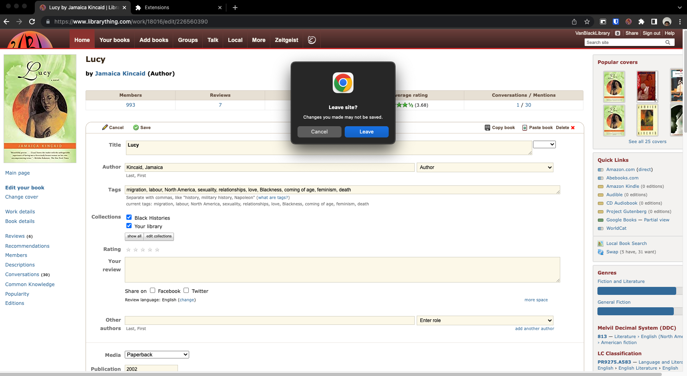
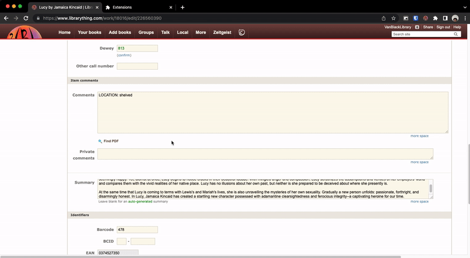
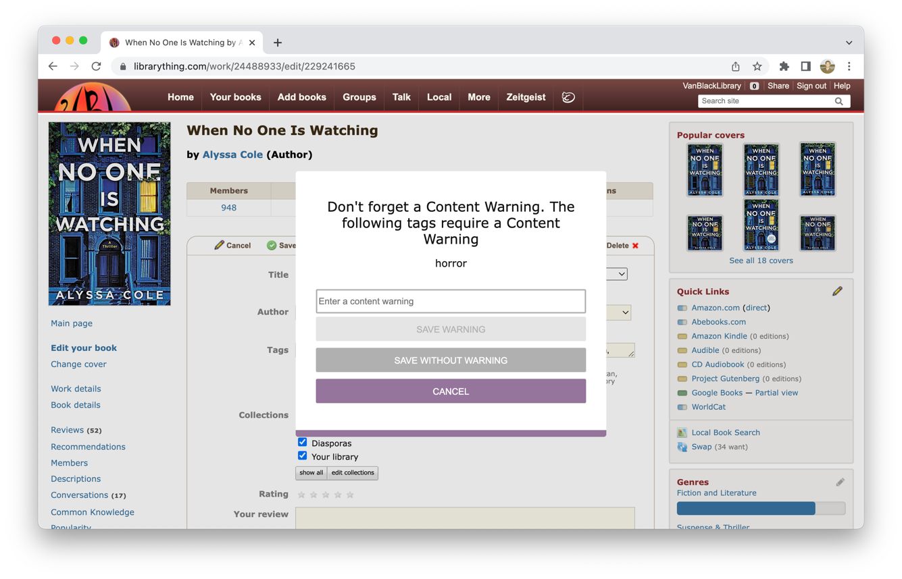

# Better LibraryThing

A browser extension to improve the LibraryThing cataloguing experience. Made in support of the [Vancouver Black Library](https://www.vancouverblacklibrary.org/).

	

## Installation

[link-chrome]: https://chrome.google.com/webstore/detail/better-librarything/hbnlneckiahefebnpdhgpohonfkkcaln 'Version published on Chrome Web Store'
[link-firefox]: https://addons.mozilla.org/en-US/firefox/ 'Version published on Mozilla Add-ons (TODO)'

[][link-chrome] also compatible with [][link-chrome] [][link-chrome] [][link-chrome]

[][link-firefox]

## Features

### Warnings

While Editing a book, leaving the page without hitting Save, Cancel, or Delete Book cause a warning if there is unsaved work.

### Copy/Paste

While on the Edit book page, a Copy and Paste button appear to allow you to Copy and Paste entire book entries.

### Find PDF

While Editing a book, click on the `Find PDF` to search the internet for PDFs of the book.
Results are pulled from libgen and The Internet Archive, with more websites to be added in the future.

Please make sure to check the links! They may not be perfect!

### Find Summary

While Editing a book, click on the `Find Summary` to search the internet for summaries of the book.
Results are pulled from Goodreads and Amazon, with more websites to be added in the future.

Please make sure to review the summaries! They may not be perfect!

### Author Pages

Edit an author's tags from the Author page! For more information, see the instructions [here](./docs/librarian/authors.md).

Requires a [Tag Index](./docs/librarian/tag-index.md).

### Tag Validation

While inputting tags, if you enter a tag that is has not been added to The Tag Index, you will receive a warning from Better LibraryThing.

Additionally, tags that are cased incorrectly can be automatically fixed, and the ancestors of nested tags can be automatically inserted.

Requires a [Tag Index](./docs/librarian/tag-index.md).

### Content Warning Reminders

While inputting tags, if you enter a tag that requires a Content Warning (according to the Tag Index) and you have forgotten to input it, you will receive a warning from Better LibraryThing.

Requires a [Tag Index](./docs/librarian/tag-index.md).

### VBL Banner

When the extension is used, the LibraryThing banner is replaced with a [Vancouver Black Library](https://www.vancouverblacklibrary.org/), so you can discern whether the extension is active at a glance.

The banner will also be grey if you are not logged in to the VanBlackLibrary LibraryThing and Google accounts.

### Misc. Improvements
- **Resizes**: When you resize a text area in a book form, the new size saved for the next time you visit!
- **Sort Indicator**: Changing a book title's sorting will show you what the book will be sorted as directly on the form.

## Documentation

- [Author Pages](./docs/librarian/authors.md)
- [The Tag Index](./docs/librarian/tag-index.md)
- [Managing the Tag Index](./docs/librarian/tag-index-management.md)
- [Developing](./docs/developer/README.md)
- [Privacy Policy](./docs/misc/privacy-policy.md)
- [Release History](https://github.com/braxtonhall/library-thing/releases)
