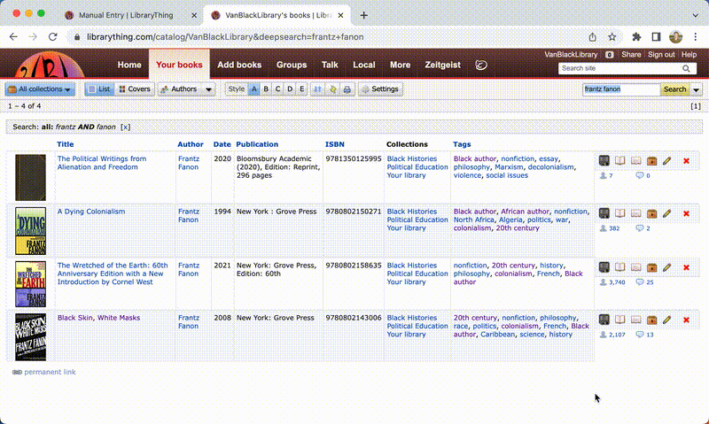

# Better Library Thing

A browser extension to improve the LibraryThing cataloguing experience. Made in support of the [Vancouver Black Library](https://www.vancouverblacklibrary.org/).

	

## Features

### Warnings

While Editing a book, leaving the page without hitting Save, Cancel, or Delete Book cause a warning if there is unsaved work.

### Copy/Paste

While on the Edit book page, a Copy and Paste button appear to allow you to Copy and Paste entire book entries.

### Find PDF

While Editing a book, click on the `Find PDF` to search the internet for PDFs of the book.
Results are pulled from z-lib, libgen, and The Internet Archive, with more websites to be added in the future.

Please make sure to check the links! They may not be perfect!

### Find Summary

While Editing a book, click on the `Find Summary` to search the internet for summaries of the book.
Results are pulled from Goodreads and Amazon, with more websites to be added in the future.

Please make sure to review the summaries! They may not be perfect!

### Author Pages (Google Chrome only!)

Edit an author's tags from the Author page! For more information, see the instructions [here](./docs/librarian/authors.md).

### VBL Banner

When the extension is used, the LibraryThing banner is replaced with a [Vancouver Black Library](https://www.vancouverblacklibrary.org/), so you can discern whether the extension is active at a glance.

### Misc. Improvements
- **Resizes**: When you resize a text area in a book form, the new size saved for the next time you visit!

## Installation

### Chrome
1. Download and unzip the extension from the [releases page](https://github.com/braxtonhall/library-thing/releases)
1. Click `extension.zip` to download the extension zip file
1. Navigate to [`chrome://extensions`](chrome://extensions)
1. Toggle `Developer mode`
   
1. Click `Load unpacked`
   
1. Select the unzipped extension directory
   
1. The extension should be installed!
   

### Firefox
Not yet supported

### Safari
Not yet supported

### Edge
Not yet supported

### Opera
1. Download and unzip the extension from the [releases page](https://github.com/braxtonhall/library-thing/releases)
1. Click `extension.zip` to download the extension zip file
1. Navigate to [`opera://extensions`](opera://extensions)
1. Toggle `Developer mode`
1. Click `Load unpacked`
1. Select the unzipped extension directory
1. The extension should be installed!

### Brave
1. Download and unzip the extension from the [releases page](https://github.com/braxtonhall/library-thing/releases)
1. Click `extension.zip` to download the extension zip file
1. Navigate to [`brave://extensions`](brave://extensions)
1. Toggle `Developer mode`
1. Click `Load unpacked`
1. Select the unzipped extension directory
1. The extension should be installed!

## Development

### Contributing
To contribute just make a PR into the `main` branch!

1. Click `Fork` button in the top right of the [GitHub page](https://github.com/braxtonhall/library-thing)
1. Develop your feature and push to your fork
1. Click the `Pull requests` tab and then the `New pull request` in your fork
1. Set the base repo and branch to be `braxtonhall/library-thing` and `main`
1. Click `Create pull request`

### Requirements
- [Node](https://nodejs.org/en/)
- [Yarn](https://classic.yarnpkg.com/en/docs/install)

### Scripts
- **`yarn install`**: Gathers all dependencies. This should be run at the start of development on a new clone in the root.
- **`yarn build`**: Compiles the `.ts` files to `.js` files in the `extension/js/` dir.
- **`yarn watch`**: Runs a new build any time any file changes are detected.
- **`yarn lint`**: Lints the `extension/ts/` files.
- **`yarn fix`**: Fixes all automatically fixable lint errors in the `extension/ts/` files.
- **`yarn pretty`**: Prettifies the `extension/ts/` files.
- **`yarn test`**: Runs all `*.spec.ts` files the `test/` directory.
