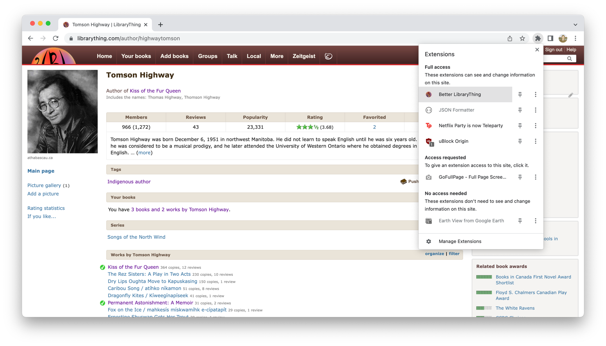
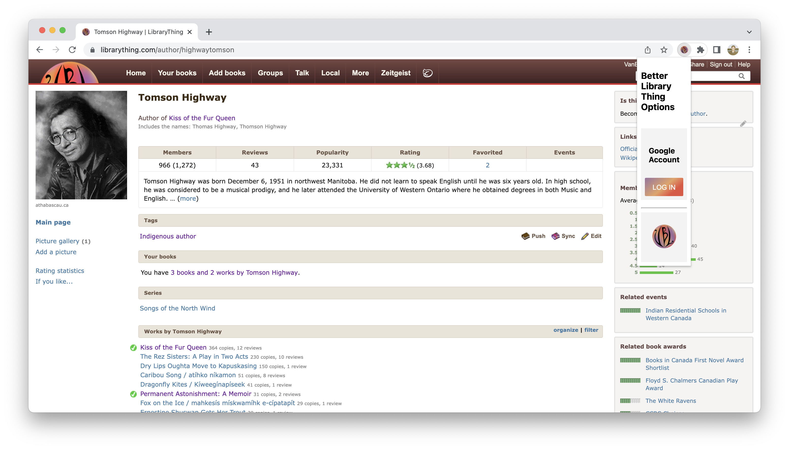
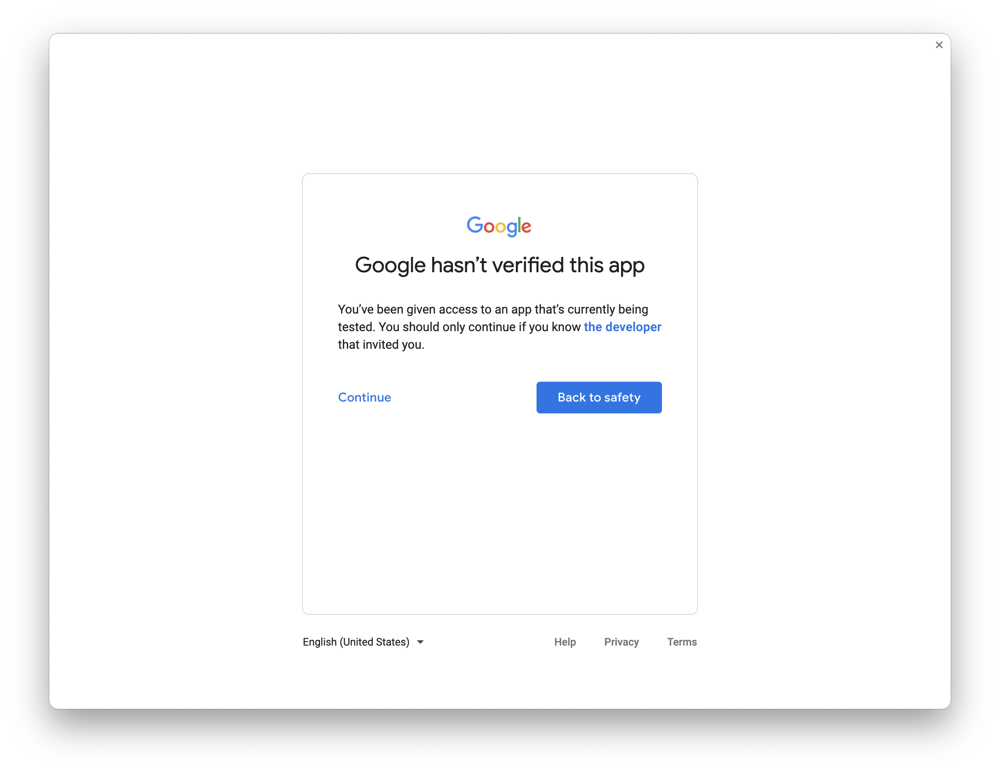
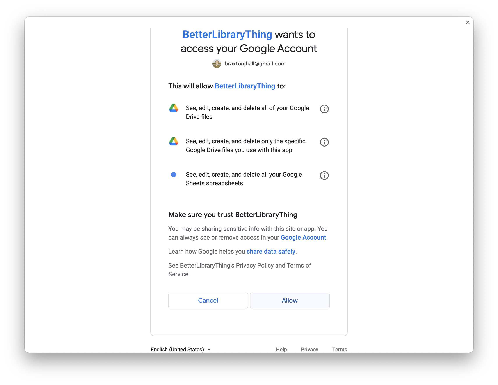
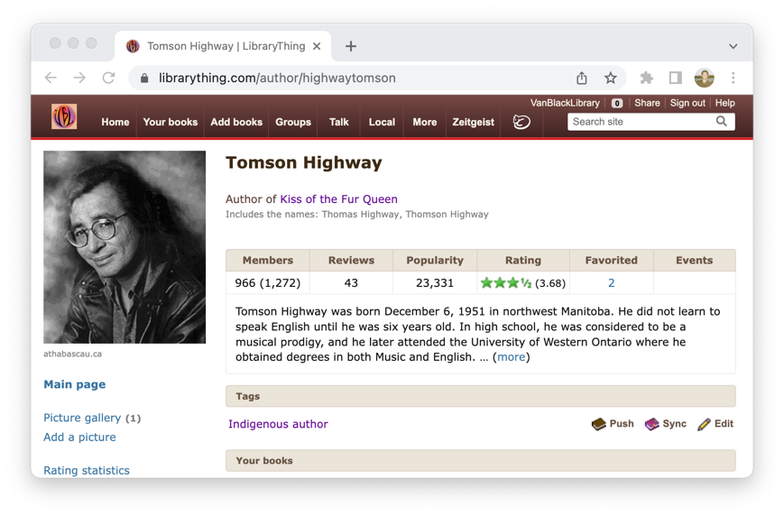
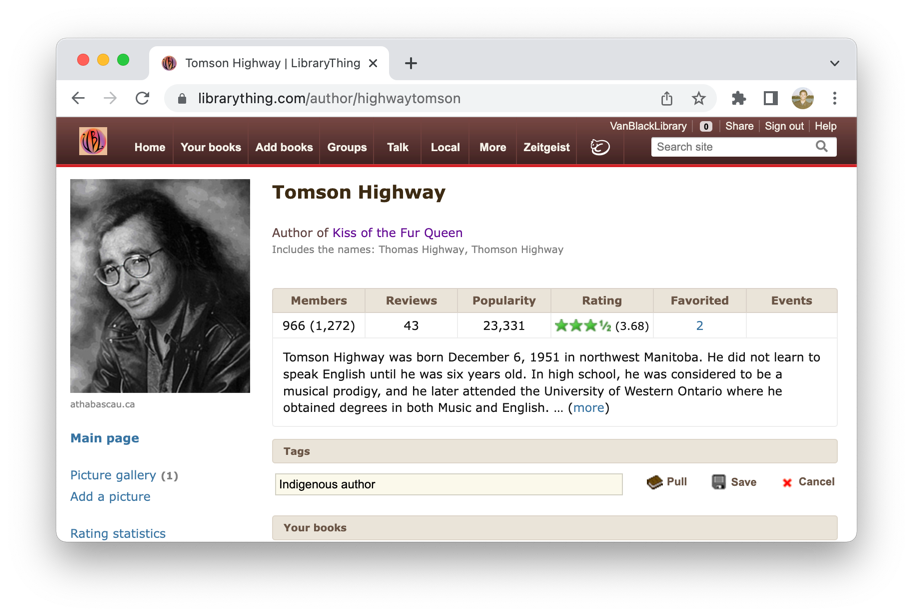
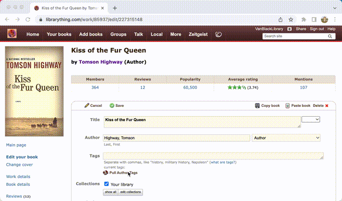

# Author Tags

Author Tags are used to store information about an author in a centralised way, allowing librarianettes to add consistent author metadata to every book by an author.

## Prerequisites

1. You must be using Google Chrome. While we hope to support other browsers in the future, Chrome is the only browser supported at the moment.

1. You must be logged in with a Google account associated with the Better LibraryThing project.
If you are a volunteer librarianette for VBL, you will find this account in the volunteer resources.
Otherwise, you can request that _your_ Google account be added.
   ### Logging In
   1. With Better LibraryThing installed, click Extensions, and then Better LibraryThing
	  
   1. Next click Log In
	  
   1. Google will present you with a pop-up and warn you that this app hasn't been verified. Click Continue.
	  
   1. Click Allow
	  
   1. You are now logged in!

## Features

LibraryThing stores all tags on _books_, not on authors. At VBL, we wish to capture information about an author in a books tags, yet keep them consistent across all books by an author.

This section describes how you can do that.

### Author Side

Author's pages will show their tags. The picture above shows the default view.

The three buttons are:
1. **Push**: all tags associated with the author are appended to the list of tags for all books by that author.
1. **Sync**: performs a push, and additionally _removes_ any extra tags on a book that are not associated with any of its authors. _Ensure that your author tags are correct before performing a sync!_
1. **Edit**: brings up the edit view

The edit view (pictured above) has three additional buttons, described below:
1. **Pull**: copies all author tags associated with an authors books to the author. This is useful if you have existing books with author tags on them, and an empty author page with no tags on it yet.
1. **Save**: saves the author tags
1. **Cancel**: returns to the default view.

### Book Side

Author tags can also be used while editing a book!

Click "Pull Author Tags" to copy all tags associated with every author of the book into the Tags field in the edit form.
