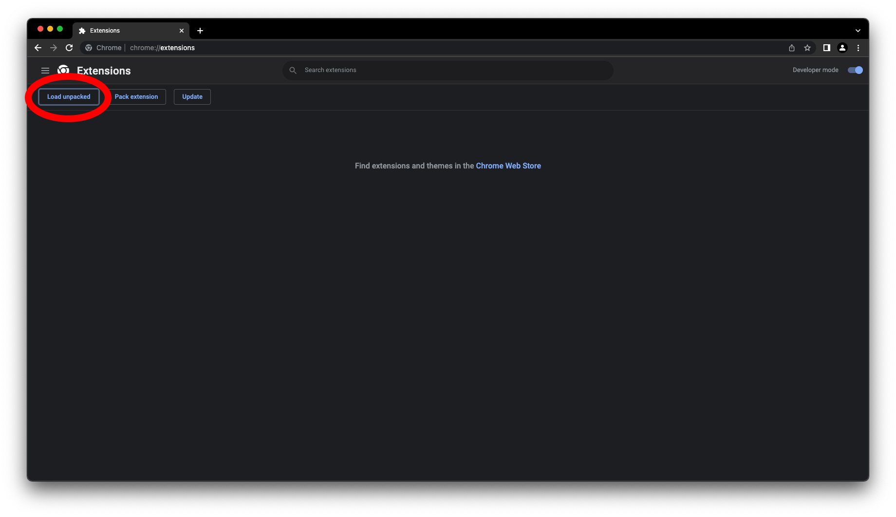
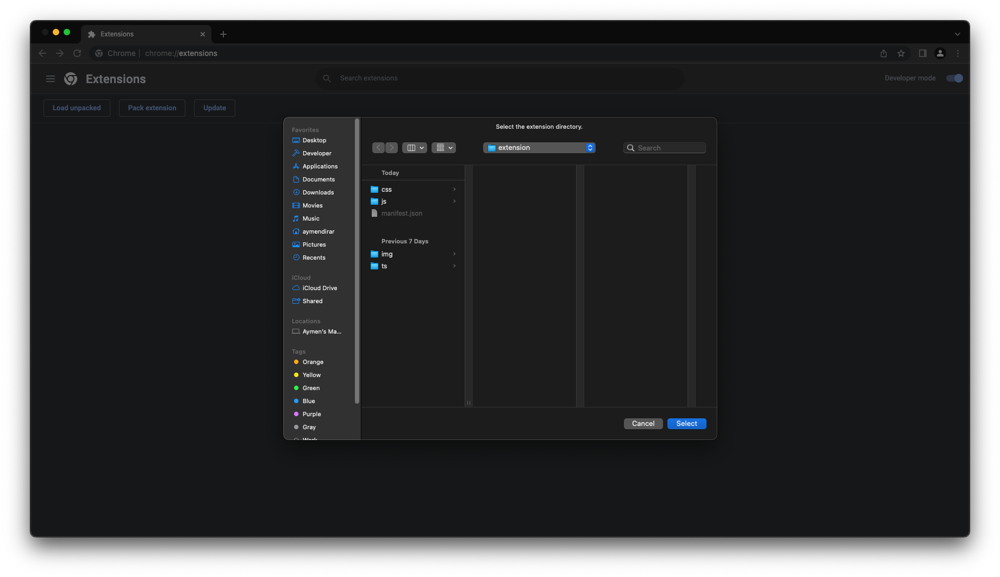
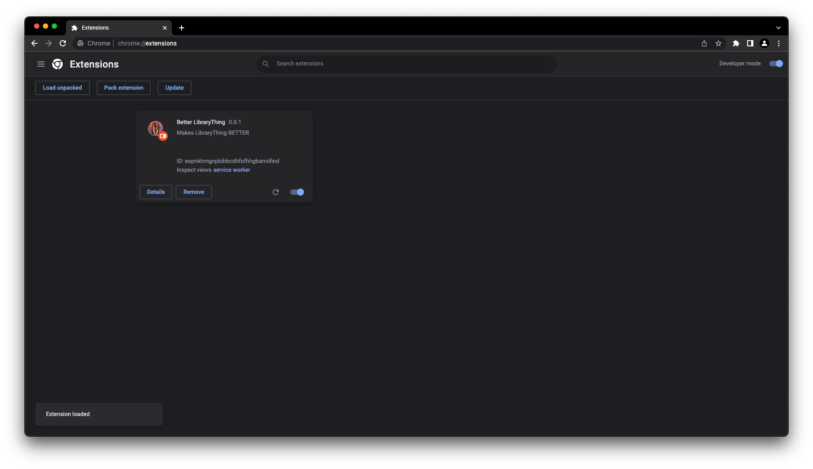

## Installation

### Chrome
1. Download and unzip the extension from the [releases page](https://github.com/braxtonhall/library-thing/releases)
1. Click `extension.zip` to download the extension zip file
1. Navigate to [`chrome://extensions`](chrome://extensions)
1. Toggle `Developer mode`
   
1. Click `Load unpacked`
   
1. Select the unzipped extension directory
   
1. The extension should be installed!
   

### Firefox
Not yet supported

### Safari
Not yet supported

### Edge
Not yet supported

### Opera
1. Download and unzip the extension from the [releases page](https://github.com/braxtonhall/library-thing/releases)
1. Click `extension.zip` to download the extension zip file
1. Navigate to [`opera://extensions`](opera://extensions)
1. Toggle `Developer mode`
1. Click `Load unpacked`
1. Select the unzipped extension directory
1. The extension should be installed!

### Brave
1. Download and unzip the extension from the [releases page](https://github.com/braxtonhall/library-thing/releases)
1. Click `extension.zip` to download the extension zip file
1. Navigate to [`brave://extensions`](brave://extensions)
1. Toggle `Developer mode`
1. Click `Load unpacked`
1. Select the unzipped extension directory
1. The extension should be installed!
