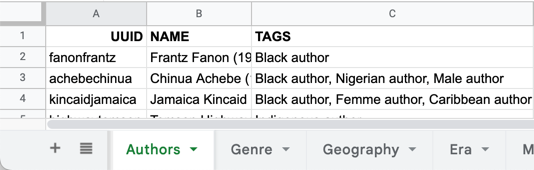
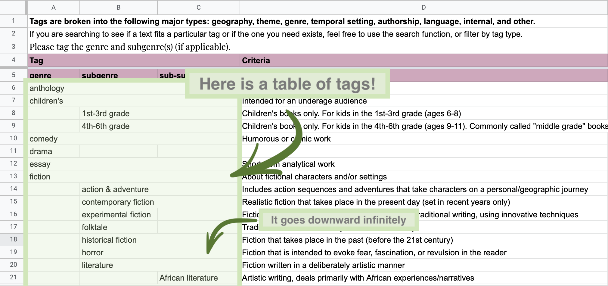
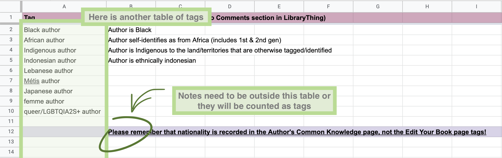
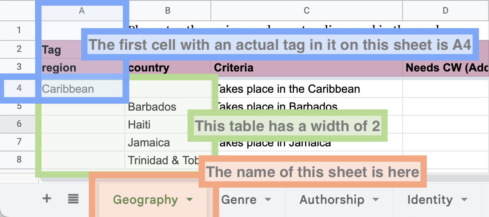
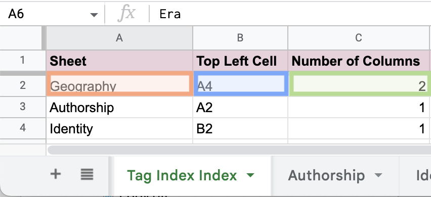

# Tag Index Requirements

The document is intended for VBL librarians.
It describes the requirements of [The Tag Index](https://docs.google.com/spreadsheets/d/1EfwBhY56M8OwgVjFTWxxxdoIxK8osw2vfgsXnCyGGuA) such that it integrates with Better LibraryThing.

## Authors Sheet

In order to support [author tagging](./authors.md), Better LibraryThing will store author tags in The Tag Index.

1. There _must_ be a single sheet in The Tag Index labelled **Authors**.
1. Column `A` _must_ be the ID of an author as used by LibraryThing.
1. Column `B` _must_ be the name of the author.
1. Column `C` _must_ be the author tags.
1. None of these columns can be hidden, however the sheet itself may be hidden.
1. Additionally, there must be _another_ sheet in The Tag Index labelled **LOOKUP**. This sheet should be hidden.

Example:

## Tag Sheets

In order to perform validation of tags, Better LibraryThing will read all the tags stored in The Tag Index.

Every sheet that contains tags should have its tags stored in a table with no additional labels in it.
This table is assumed to be of infinite length.

Examples:

## Tag Index _Index_

The Tag Index _Index_ is used to tell Better Library Thing where all the tables of tags are.

1. There _must_ be a single sheet in The Tag Index called **Tag Index Index**
1. Column `A` _must_ be the name of a sheet where there are tags
1. Column `B` _must_ be the top left cell in that sheet where there are tags
1. Column `C` _must_ be the width of the table in that sheet that contains tags
1. Column `D` is optional, and can [remap tags](#tag-remapping).

Example sheet with Tags:

Example Tag Index _Index_:

### Tag Remapping

A tag remapper is a string which transforms tags. A tag remapper _must_ contain `$TAG`.
Tag remapping allows a Librarian to quickly add many tags that are transformations of existing tags.

For example, given a `Colours` sheet containing the tags `Red`, `Green`, and `Blue`, and the tag remapper `$TAG author`,
Better LibraryThing will artificially inflate the Tag Index with the new tags `Red author`, `Green author`, and `Blue author`.

Created for VBL with the intention of Librarians remapping the `Indentity` sheet with `$TAG author`.
