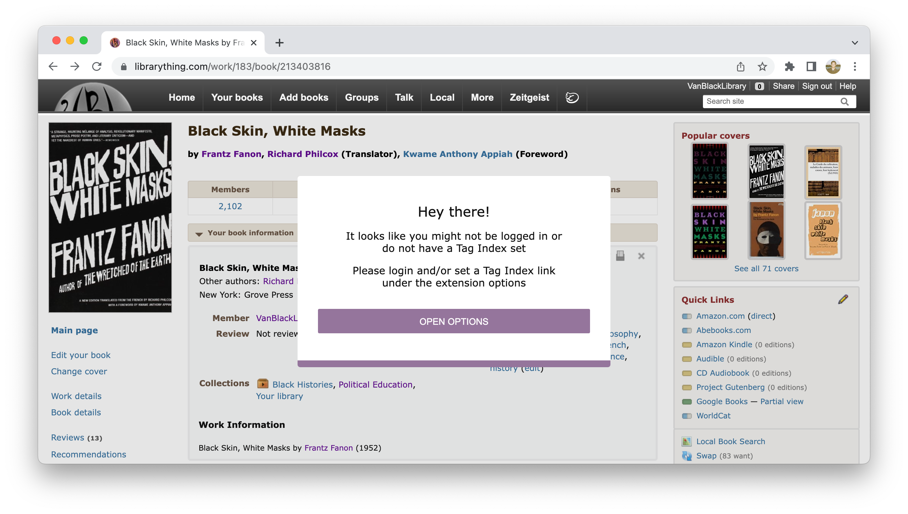

# The Tag Index

To manage, validate, and autocorrect tags as you input them into LibraryThing, Better LibraryThing requires an index
of your library's tags, and direct access to it through a Google account.

## Set up

When you first visit [LibraryThing](https://librarything.com) with the Better LibraryThing extension, you'll be met with this screen:

Without access to the Tag Index, you can't use many of Better LibraryThing's safety features, which is why to the warning is in place.

To make the warning go away, click "Open Options", set the Tag Index, and Log In to Google.
You'll know you've completed everything correctly when the banner at the top of the page goes from greyscale to in colour!

### Setting the Tag Index

1. Get a link to a Tag Index!
   - If you are a VBL librarianette, the link to the Tag Index will be in the volunteer resources.
   - If you are using Better LibraryThing for your own library, see the [instructions on how to manage/create a Tag Index](./tag-index-management.md).
1. With Better LibraryThing installed, open the extension options, and save the Tag Index link. 

### Accessing the Tag Index
1. With Better LibraryThing installed, open the extension options, and click Log In.
1. A window from Google should pop up, where you can proceed to sign in.
